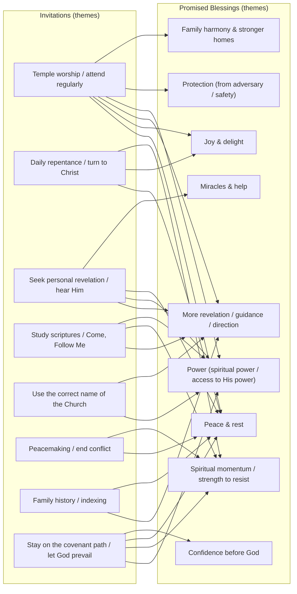
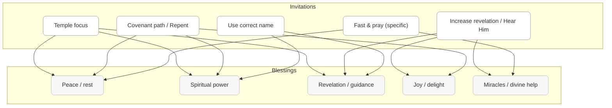

# Visualizing Invitations from President Nelson

```mermaid
flowchart LR
  %% Invitation themes
  subgraph INV["Invitations (themes)"]
    TPL["Temple worship / attend regularly"]
    REP["Daily repentance / turn to Christ"]
    REV["Seek personal revelation / hear Him"]
    SCR["Study scriptures / Come, Follow Me"]
    NAM["Use the correct name of the Church"]
    PCE["Peacemaking / end conflict"]
    FAM["Family history / indexing"]
    CVT["Stay on the covenant path / let God prevail"]
  end

  %% Promised blessings (aggregates distilled from your CSV)
  subgraph BLESS["Promised Blessings (themes)"]
    PEACE["Peace & rest"]
    JOY["Joy & delight"]
    PWR["Power (spiritual power / access to His power)"]
    REV2["More revelation / guidance / direction"]
    PROT["Protection (from adversary / safety)"]
    MIR["Miracles & help"]
    MOM["Spiritual momentum / strength to resist"]
    CONF["Confidence before God"]
    FAMH["Family harmony & stronger homes"]
  end

  %% Mappings (many-to-many)
  TPL --> PEACE
  TPL --> JOY
  TPL --> REV2
  TPL --> PWR
  TPL --> PROT
  TPL --> FAMH

  REP --> PEACE
  REP --> JOY
  REP --> MOM

  REV --> REV2
  REV --> PWR
  REV --> PEACE
  REV --> MIR

  SCR --> REV2
  SCR --> MOM
  SCR --> PWR

  NAM --> PWR
  NAM --> REV2

  PCE --> PEACE
  PCE --> MOM

  FAM --> REV2
  FAM --> PEACE

  CVT --> PWR
  CVT --> MOM
  CVT --> PEACE
  CVT --> CONF
```

```mermaid
flowchart TB
  classDef inv fill:#fff,stroke:#999,rx:8
  classDef out fill:#f6f6f6,stroke:#bbb,rx:8

  subgraph Invitations
    TPL["Temple focus"]:::inv
    REV["Increase revelation / Hear Him"]:::inv
    CVT["Covenant path / Repent"]:::inv
    NAM["Use correct name"]:::inv
    FST["Fast & pray (specific)"]:::inv
  end

  subgraph Blessings
    PEACE["Peace / rest"]:::out
    PWR["Spiritual power"]:::out
    REV2["Revelation / guidance"]:::out
    JOY["Joy / delight"]:::out
    MIR["Miracles / divine help"]:::out
  end

  TPL --> PEACE
  TPL --> REV2
  TPL --> PWR

  REV --> REV2
  REV --> MIR
  REV --> JOY

  CVT --> PEACE
  CVT --> PWR
  CVT --> JOY

  NAM --> PWR
  NAM --> REV2

  FST --> MIR
  FST --> PEACE
```