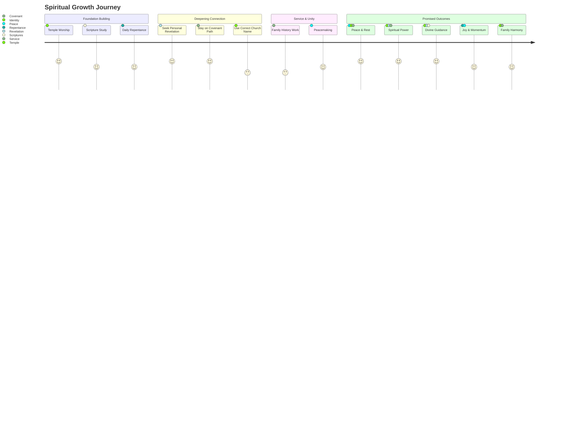

# Visualizing Invitations from President Nelson

## Comprehensive Overview: Invitations and Blessings Network

```mermaid
flowchart TB
  %% Define styles for better visual distinction
  classDef spiritualPractice fill:#e1f5fe,stroke:#0277bd,stroke-width:2px
  classDef personalGrowth fill:#f3e5f5,stroke:#7b1fa2,stroke-width:2px
  classDef service fill:#e8f5e8,stroke:#388e3c,stroke-width:2px
  classDef identity fill:#fff3e0,stroke:#f57c00,stroke-width:2px
  
  classDef innerPeace fill:#ffebee,stroke:#c62828,stroke-width:2px
  classDef spiritualPower fill:#f1f8e9,stroke:#558b2f,stroke-width:2px
  classDef guidance fill:#e3f2fd,stroke:#1565c0,stroke-width:2px
  classDef relationships fill:#fce4ec,stroke:#ad1457,stroke-width:2px

  %% Grouped Invitations by Theme
  subgraph SPIRITUAL["🙏 Spiritual Practices"]
    TPL["Temple worship /<br/>attend regularly"]:::spiritualPractice
    SCR["Study scriptures /<br/>Come, Follow Me"]:::spiritualPractice
    REV["Seek personal revelation /<br/>hear Him"]:::spiritualPractice
  end

  subgraph GROWTH["📈 Personal Growth"]
    REP["Daily repentance /<br/>turn to Christ"]:::personalGrowth
    CVT["Stay on covenant path /<br/>let God prevail"]:::personalGrowth
  end

  subgraph SERVICE["🤝 Service & Unity"]
    PCE["Peacemaking /<br/>end conflict"]:::service
    FAM["Family history /<br/>indexing"]:::service
  end

  subgraph IDENTITY["⚡ Identity & Witness"]
    NAM["Use correct name<br/>of the Church"]:::identity
  end

  %% Grouped Blessings by Category
  subgraph INNER["🕊️ Inner Peace & Joy"]
    PEACE["Peace & rest"]:::innerPeace
    JOY["Joy & delight"]:::innerPeace
    CONF["Confidence before God"]:::innerPeace
  end

  subgraph POWER["💪 Spiritual Strength"]
    PWR["Spiritual power /<br/>access to His power"]:::spiritualPower
    MOM["Spiritual momentum /<br/>strength to resist"]:::spiritualPower
    PROT["Protection from<br/>adversary / safety"]:::spiritualPower
  end

  subgraph GUIDANCE["🧭 Divine Guidance"]
    REV2["More revelation /<br/>guidance / direction"]:::guidance
    MIR["Miracles & help"]:::guidance
  end

  subgraph FAMILY["👨‍👩‍👧‍👦 Family & Relationships"]
    FAMH["Family harmony &<br/>stronger homes"]:::relationships
  end

  %% Primary connections (strongest correlations)
  TPL -.-> PEACE
  TPL --> REV2
  TPL --> PWR
  TPL -.-> FAMH

  REV --> REV2
  REV --> PWR
  REV -.-> MIR

  SCR --> REV2
  SCR --> MOM
  SCR -.-> PWR

  REP --> PEACE
  REP -.-> JOY
  REP --> MOM

  CVT --> PWR
  CVT --> MOM
  CVT --> PEACE
  CVT -.-> CONF

  NAM --> PWR
  NAM -.-> REV2

  PCE --> PEACE
  PCE -.-> MOM

  FAM --> REV2
  FAM -.-> PEACE

  %% Secondary connections
  TPL -.-> JOY
  TPL -.-> PROT
```

## Simplified Core Relationships

```mermaid
flowchart TB
  classDef coreInv fill:#bbdefb,stroke:#1976d2,stroke-width:3px
  classDef supportInv fill:#e1f5fe,stroke:#0288d1,stroke-width:2px
  classDef primaryBlessing fill:#c8e6c9,stroke:#388e3c,stroke-width:3px
  classDef secondaryBlessing fill:#f1f8e9,stroke:#689f38,stroke-width:2px

  %% Core spiritual practices (most connections)
  subgraph CORE["🎯 Core Spiritual Foundation"]
    direction TB
    TPL["🏛️ Temple<br/>Worship"]:::coreInv
    REV["👂 Hear Him /<br/>Personal Revelation"]:::coreInv
    CVT["⚖️ Covenant Path /<br/>Let God Prevail"]:::coreInv
  end

  %% Supporting practices
  subgraph SUPPORT["🌱 Supporting Practices"]
    direction TB
    SCR["📖 Scripture<br/>Study"]:::supportInv
    REP["🔄 Daily<br/>Repentance"]:::supportInv
    PCE["🕊️ Peacemaking"]:::supportInv
    FAM["👥 Family<br/>History"]:::supportInv
    NAM["⚡ Church<br/>Name"]:::supportInv
  end

  %% Primary blessings (most frequently promised)
  subgraph PRIMARY["✨ Primary Blessings"]
    direction LR
    PEACE["🕊️ Peace &<br/>Rest"]:::primaryBlessing
    PWR["💪 Spiritual<br/>Power"]:::primaryBlessing
    REV2["🧭 Revelation &<br/>Guidance"]:::primaryBlessing
  end

  %% Secondary blessings
  subgraph SECONDARY["🌟 Additional Blessings"]
    direction LR
    JOY["😊 Joy &<br/>Delight"]:::secondaryBlessing
    MOM["⚡ Spiritual<br/>Momentum"]:::secondaryBlessing
    MIR["🙏 Miracles &<br/>Help"]:::secondaryBlessing
    PROT["🛡️ Protection"]:::secondaryBlessing
    FAMH["👨‍👩‍👧‍👦 Family<br/>Harmony"]:::secondaryBlessing
    CONF["🌅 Confidence<br/>before God"]:::secondaryBlessing
  end

  %% Strong correlations (thick lines)
  TPL ==> PEACE
  TPL ==> REV2
  TPL ==> PWR
  
  REV ==> REV2
  REV ==> PWR
  
  CVT ==> PWR
  CVT ==> PEACE

  %% Medium correlations (normal lines)
  SCR --> REV2
  SCR --> MOM
  
  REP --> PEACE
  REP --> MOM
  
  NAM --> PWR
  NAM --> REV2
  
  PCE --> PEACE
  FAM --> REV2

  %% Weaker but meaningful connections (dotted)
  TPL -.-> FAMH
  TPL -.-> JOY
  TPL -.-> PROT
  
  REV -.-> MIR
  REV -.-> PEACE
  
  CVT -.-> MOM
  CVT -.-> CONF
  
  REP -.-> JOY
  PCE -.-> MOM
  FAM -.-> PEACE
```

## Journey Map: From Invitation to Blessing

```mermaid
journey
    title Spiritual Growth Journey
    section Foundation Building
      Temple Worship           : 5: Temple
      Scripture Study          : 4: Scriptures
      Daily Repentance         : 4: Repentance
    section Deepening Connection
      Seek Personal Revelation : 5: Revelation
      Stay on Covenant Path    : 5: Covenant
      Use Correct Church Name  : 3: Identity
    section Service & Unity
      Family History Work      : 3: Service
      Peacemaking             : 4: Peace
    section Promised Outcomes
      Peace & Rest            : 5: Peace, Temple, Covenant
      Spiritual Power         : 5: Temple, Revelation, Covenant
      Divine Guidance         : 5: Temple, Revelation, Scriptures
      Joy & Momentum          : 4: Repentance, Peace
      Family Harmony          : 4: Temple, Service
```